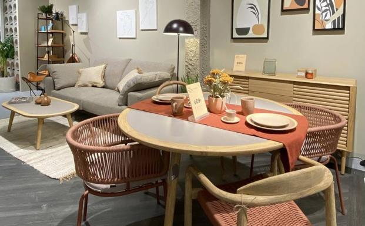

# web-scrapping-miniproject

OBJETIVO:
Tenemos como objetivo para este mini proyecto, sacar información de una web a través de Selenium. En mi caso, trabajo para una marca de venta de muebles y voy a comparar el producto con una marca de la competencia, "Kave Home", concretamente de los modelos y precios de las sillas que tienen en stock.

Me gustaría comprobar los siguientes puntos relacionados con las sillas de esta marca:
    - Comprobar si existe alguna silla con valor superior a 300€
    - Conocer el precio medio de las sillas de esta marca
    - Comparar si existen más sillas de color gris que de color verde

EJECUCIÓN:
Para conseguir dicho objetivo, he adquirido de la web de dicha marca, toda la información relacionada con las sillas, el nombre, la descripción y el precio. En cuanto al precio, exisitían algunos modelos con precios rebajados, pero he tenido en cuenta solo los precios finales reales, sin tener en cuenta los precios iniciales antes de rebaja.

VISUALIZACIÓN:

Las dos primeras hipótesis he podido comprobarlas directamente con la información obtenida del dataframe final conseguido, pero para poder comparar el número de sillas por colore, he creado una nueva columna "Colo" utilizando el método regex.

ESTRUCTURA DEL PROYECTO: 
    - Una carpeta única que contiene:
        - el csv final con el dataframe de los valores obtenidos de la web
        - 5 imágenes formato .jpg con los gráficos obtenidos en la visualización para la comprobación de hipótesis.
        - un archivo .exe necesario para conseguir el driver
        - un archivo jupyter notebook "scrapping" con todo el código utlizado para el scrapeo, limpieza y visualización
        - un archivo jupyter notebook "" con las imágenes importadas en markdown.
        
CONCLUSIÓN FINAL:
Mediante los gráficos de visualización hemos podido observar las siguientes conclusiones:
    - Comprobar si existe alguna silla con valor superior a 300€--> Se refuta la hipótesis, ya que no existe ninguna silla que supere dicho valor
    - Conocer el precio medio de las sillas de esta marca --> El precio medio de las sillas de esta marca es de unos 130€
    - Comparar si existen más sillas de color gris que de color verde --> Se cumple esta hipótesis, ya que efectivamente existen más sillas de color gris que de color verde.

Para conseguir los objetivos del proyecto he usado los siguientes recursos:
-- https://kavehome.com/es/es/

- selenium (https://www.selenium.dev/es/documentation/)
- sys(https://docs.python.org/3/library/sys.html)
- pandas(https://pandas.pydata.org/)
- re(https://docs.python.org/3/library/re.html)
- plotly(https://plotly.com/python-api-reference/plotly.express.html)
- matplotlib (https://matplotlib.org/)
- seaborn(https://seaborn.pydata.org/)
